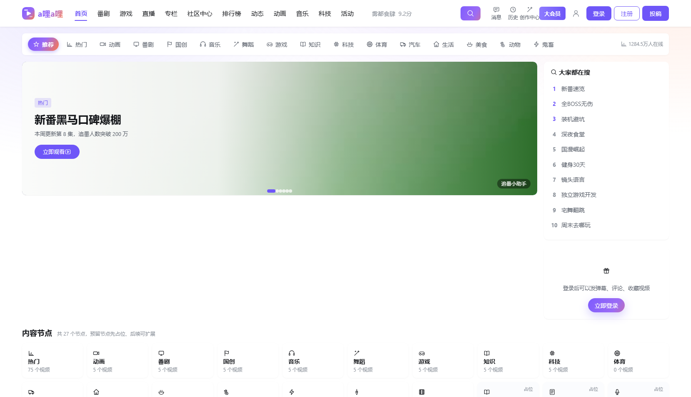
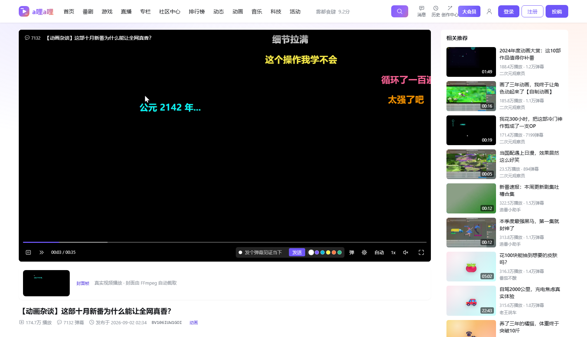
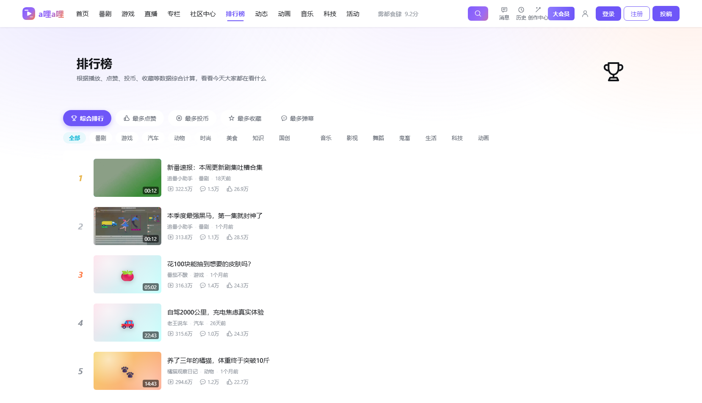
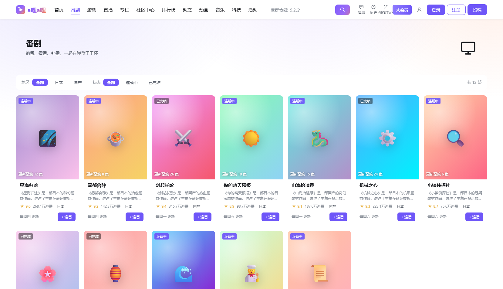
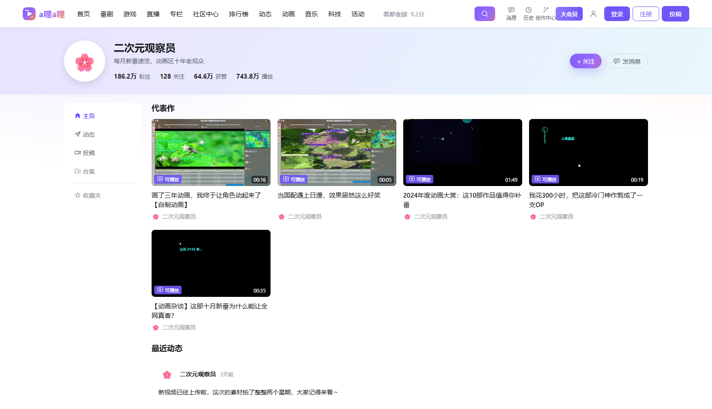

# a哩a哩


一个**a哩a哩风格的完整前后端分离网站**：真实视频播放、弹幕播放器、一键三连、排行榜、追番、个人空间、
动态、搜索、投稿，还有 **图形验证码 / 邮箱验证码 / 二维码** 三种登录方式，数据全部落在**本机 MySQL**。

- 🎬 **真实视频播放**：原生 `<video>` + HTTP Range（可拖进度条），封面用 **FFmpeg 自动截帧**生成
- 🔐 **三种登录方式**：账号密码 + 图形验证码、邮箱验证码（注册 / 登录 / 找回密码）、二维码扫码登录
- 🗄️ **接入本机 MySQL**：启动自动迁移 + 空库自动灌演示数据，重启数据不丢（连不上数据库也能降级跑）
- 🧩 **28 个内容节点 + 15 个子节点**：视频 / 游戏 / 直播 / 番剧 / 专栏 / 活动 / 社区中心… 点击都有入口，预留节点有占位页
- 🎨 **自己的视觉语言**：交互照搬"视频社区"那套好用的范式，配色 / 标志 / 组件全部原创（见下方「视觉设计」）
- 📱 **响应式 + 老浏览器兼容**：browserslist + Autoprefixer + legacy 包 + polyfill，手机 / 平板 / 桌面都不错位

> 📄 改造细节、数据库变更 SQL、验收清单请看 **[docs/改造说明与验收.md](docs/改造说明与验收.md)**
>
> 站内所有 UP 主、视频、弹幕、评论均为程序生成的假数据，**不包含任何真实视频内容**。

---

## 一、效果预览

| 首页（轮播 + 内容节点 + 推荐流） | 播放页（真实视频 + 弹幕 + 三连 + 评论） |
| --- | --- |
|  |  |

| 排行榜 | 番剧（追番） | 个人空间 |
| --- | --- | --- |
|  |  |  |

> 跑起来之后最新的截图会自动写到 `shots/`（`node tools/verify.mjs` 会重新截图）。

---

## 二、视觉设计：像"视频社区"，但不是"另一个粉色 B 站"

弹幕、分区导航、卡片流、一键三连、追番、楼中楼……这些**交互范式**是一个视频社区真正好用的地方，
本站把它们完整保留下来。但**外观上刻意另起一套**，理由很简单：照着别人的品牌色做，永远只能是"像"。

### 品牌标志：从"弹幕"而不是"电视"出发

哔哩哔哩的标志是一只带天线的电视，识别度极高——也正因如此，任何"电视 + 天线"的造型都会被直接读成模仿。
`frontend/src/ui/AiLogo.vue` 换了个出发点，用三层基础几何形讲同一件事：

| 元素 | 含义 |
| --- | --- |
| 圆角方块 | 一块"屏幕"，承载极光渐变品牌色 |
| 播放三角 | 视频 / 播放，压在方块中央，最易读懂的一层 |
| 两道弹幕条 | 一长一短、透明度不同，从三角两侧掠出画面——既像弹幕飞过，也给了标志速度感 |

### 配色：极光（Aurora），不是粉

| 角色 | 色值 | 用在哪 |
| --- | --- | --- |
| 品牌紫 `--brand-500` | `#6e56f8` | 主按钮、导航选中、链接、进度条 |
| 珊瑚橙 `--accent-500` | `#ff7a45` | 渐变收尾、激励 / 强调 |
| 天青 `--cyan-500` | `#12b7d6` | 信息、直播、次要动作 |
| 薄荷 `--mint-500` | `#2dbe8b` | 等级 / 经验 / 成功 |
| 星金 `--gold-500` | `#e8b44a` | 等级徽章、大会员 |
| 玫瑰 `--rose-500` | `#f5455c` | 危险、取关、错误 |

主色从"紫"出发而不是粉，配一条 `紫 → 珊瑚橙` 的极光渐变做品牌记忆点。

### 落地方式

- 所有颜色 / 圆角 / 阴影 / 间距都是 `frontend/src/styles/tokens.css` 里的设计令牌，组件里**不写死色值**；
- Element Plus 的 `--el-*` 变量在 `styles/element-theme.css` 里整体映射到上面这套令牌，
  官方蓝不会串进来（用 `html:root` 提高特异度，避免和组件库的加载顺序打架）；
- 明暗两套主题都覆盖到了，切换时不会有"没改到"的角落。

---

## 三、快速开始

### 0. 环境要求

| 依赖 | 版本 | 说明 |
| --- | --- | --- |
| JDK | 17+ | Spring Boot 3 需要 Java 17 |
| Node.js | 18+ | 只在前端打包时需要 |
| Maven | 3.9+ | 只在后端打包时需要 |
| MySQL | 5.7 / 8.x | 默认连接 `localhost:3306/bili_clone`，账号 `root` / 密码 `123456`（可在 `.env` / 环境变量里改） |
| FFmpeg | 可选 | 用来截封面帧。没装也没关系，`pip install imageio-ffmpeg` 即可（后端会自动找到） |

> 数据库不存在也没问题：只要本机 MySQL 能连上、账号有权限，把 `DB_NAME` 指过去即可，
> 后端会用 `CREATE TABLE IF NOT EXISTS` 建好全部结构并灌入演示数据。
> 已经有库？会在**原结构上**用 `ALTER TABLE` 补字段，不删表、不重建。

### 方式 1：Windows 一键脚本

| 脚本 | 作用 |
| --- | --- |
| **`启动网站.bat`** | 启动网站，自动打开浏览器 http://localhost:8080 |
| `重新构建.bat` | 改了代码后重新打包（会自动先停掉旧服务） |
| `开发模式-前端.bat` | 前端开发模式，改代码热更新，端口 5173 |
| `上传到GitHub.bat` | 把项目推送到你自己的 GitHub 仓库 |

### 方式 2：手动跑

```bash
# 1. 前端
cd frontend
npm install --include=dev
npm run build

# 2. 前端产物复制到后端静态目录
xcopy /e /i /y dist\* ..\backend\src\main\resources\static\

# 3. 后端打包
cd ..\backend
mvn package -DskipTests

# 4. 启动（自动连 MySQL + 执行迁移 + 扫描视频截封面）
java -jar target\bili-web.jar
# 打开 http://localhost:8080
```

### 方式 3：Docker

```bash
docker compose up -d
# 打开 http://localhost:8080
```

---

## 四、功能清单

### 首页
- 18+ 个内容节点导航（推荐 / 热门 / 动画 / 番剧 / 音乐 / 舞蹈 / 游戏 / 知识 / 科技 / 体育 …），点击即时切换
- **内容节点宫格**：28 个一级节点全部有入口，预留节点标注「占位」并跳转到占位页
- 轮播图：**真实封面帧铺满**（`object-fit: cover`），没有视频时用渐变 + emoji 兜底，任何分辨率都不留白
- 视频卡片网格：真实封面帧 / 渐变占位、时长角标、悬停播放蒙层、"可播放"角标、滚动淡入、鼠标倾斜

### 播放页（核心）
- **真实视频播放**：后端 `/api/files/video/**` 支持 HTTP Range，可随意拖动进度条；`poster` 用 FFmpeg 截出来的封面帧
- 没有视频文件时：渐变 + 字幕占位画面（弹幕、进度、倍速依旧可用），不会出现黑屏或大片空白
- **弹幕引擎**：按时间轴滚动 / 顶部 / 底部固定，暂停、拖动、倍速后重新对齐；可发弹幕（选颜色）+ 弹幕设置面板
- 自定义播放器：进度条悬停预览、音量、0.5~2x 倍速、清晰度切换（接 `video_sources` 表）、全屏、键盘快捷键
- **一键三连**：点赞 / 投币 / 收藏 / 分享 / 关注，全部写 MySQL，刷新页面状态不丢，还会涨经验
- 播放量、弹幕数、发布时间、BV 号、UP 主卡片、简介标签、相关推荐、评论区（排序 / 发表 / 点赞 / 楼中楼）
- **播放进度上报**：每 15 秒写一次 `watch_history`，个人中心可以继续观看

### 登录认证（三种方式）
- **账号密码 + 图形验证码**：后端 Java2D 生成 PNG，点击图片刷新，5 分钟有效、**一次性使用**，密码 BCrypt 存储
- **邮箱验证码**：注册 / 登录 / 找回密码；验证码存 `email_verification_codes`，有用途、过期时间、是否使用；开发环境打印到控制台（并在页面显示），生产环境走 SMTP
- **二维码登录**：ZXing 生成真实二维码，`WAITING → SCANNED → CONFIRMED → 拿到 token`，另有 `EXPIRED`（可一键刷新）/ `CANCELED`；
  没有手机也能体验：点「模拟手机扫码」+「确认登录」，或在新窗口打开 `/qr/<qrId>` 手机端确认页
- token 存 `user_tokens`（7 天），接口带 `Authorization: Bearer`；验证码 / 登录 / 注册 / 发信都有**频率限制**
- 演示账号：`bili_demo` / `bili123456`

### 用户系统
- 上传头像（点击 / 拖拽）、修改昵称签名、等级经验、每日签到、硬币、大会员标
- 鼠标悬停头像弹出资料卡；个人空间（主页 / 动态 / 投稿）

### 个人中心（10 个标签页）
- 我的主页（资料卡 + 数据统计 + 最近观看）、**观看历史**（含播放进度、可单条删除 / 清空）、
  **我的收藏**（多收藏夹）、点赞过、投币过、**我的关注**、**消息中心**（系统 / 回复 / 点赞 / @，可全部已读）、
  **设置**（深浅主题、自动播放、默认清晰度、弹幕默认值、隐私、改密码、换绑邮箱）、**我的投稿**、编辑资料

### 内容节点
- 28 个一级节点 + 15 个子节点，全部有路由、有入口（顶栏 / 首页 / 404 页 / 节点页底部）
- 预留节点（纪录片 / 资讯 / 娱乐 / 电影 / 综艺 / 直播 / 专栏 / 活动 / 社区中心 / 新星计划）→ 占位页，含「后续扩展计划」，**不 404 不空白**

### 其它页面
- 排行榜（5 个榜单 + 分区筛选）、番剧（地区 / 状态筛选 / 追番 / 评分）、个人空间、动态、搜索（联想词 + 相关用户 + 热搜）
- **投稿**：拖拽上传视频 → FFmpeg 自动截帧生成封面 → 直接发布（写入 `videos` + `video_uploads`）
- **404 页面**：给出节点入口和热门推荐，不会让用户卡在空白页

---

## 五、技术栈

### 前端
| 技术 | 用途 |
| --- | --- |
| **Vue 3**（`<script setup>`） | 组件开发 |
| **Vite 6** | 开发服务器 + 打包（`@vitejs/plugin-legacy` 生成兼容包） |
| **Vue Router 4** | 路由（hash 模式，刷新不会 404）+ 登录守卫 |
| **Pinia** | 登录态、用户资料、经验飘字 |
| **Axios** | 接口封装、token 注入、401 统一处理 |
| **Element Plus**（按需引入） | Dialog / Carousel / Skeleton / Popover / Upload / Message / Breadcrumb |
| **VueUse** | 全屏、鼠标倾斜、事件监听、防抖 |
| **Autoprefixer + browserslist** | 自动加 CSS 前缀，兼容不同版本浏览器 |
| 原生 CSS | 全站样式手写，CSS 变量维护 B 站配色，含深色主题变量 |

### 后端
| 技术 | 说明 |
| --- | --- |
| **Java 17 + Spring Boot 3.3** | REST 接口 |
| **Spring JDBC + HikariCP** | 手写 SQL（未引入 JPA/MyBatis），`Database` 负责连接探测与迁移 |
| **MySQL** | 全部业务数据：用户 / 视频 / 弹幕 / 评论 / 收藏 / 历史 / 消息 / 登录会话 / 内容节点 |
| **spring-security-crypto** | 只用于 BCrypt 密码哈希 |
| **ZXing** | 二维码登录（生成真实可扫二维码） |
| **spring-boot-starter-mail** | 生产环境邮箱验证码 |
| **FFmpeg** | 视频截帧封面、媒体探测、演示视频生成（找不到时自动降级为渐变占位） |
| **Maven** | 打包成一个可执行 jar |

---

## 六、目录结构

```
aliali/
├── 启动网站.bat / 重新构建.bat / 开发模式-前端.bat / 上传到GitHub.bat
├── Dockerfile / docker-compose.yml
├── .env.example                      环境变量示例（数据库 / 邮箱 / FFmpeg）
├── docs/
│   ├── 改造说明与验收.md               ★ 改造说明、数据库变更、验收清单
│   └── db/                            ★ 基线结构快照 + 迁移 SQL
├── backend/                           Spring Boot 后端
│   └── src/main/
│       ├── java/com/bili/demo/
│       │   ├── controller/            首页/视频/番剧/空间/用户 + auth/uc/media
│       │   ├── data/                  DataStore（演示数据）、UserStore（用户状态）
│       │   ├── db/                    ★ 迁移器、Repository、数据同步、节点目录
│       │   ├── auth/                  ★ 验证码、邮箱码、二维码、限流、会话
│       │   ├── media/                 ★ FFmpeg 扫描 / 截帧 / 探测
│       │   └── config/                WebConfig（静态资源 + 拦截器）、AuthInterceptor
│       └── resources/
│           ├── application.yml
│           └── db/migration/          ★ V1 基线 / V2 增量
├── frontend/                          Vue 3 前端
│   ├── postcss.config.js              ★ Autoprefixer
│   └── src/
│       ├── styles/
│       │   ├── tokens.css              ★ 设计令牌（配色 / 圆角 / 阴影 / 间距 / 动效）
│       │   └── element-theme.css       ★ Element Plus 主题桥接（--el-* 全部映射到令牌）
│       ├── ui/                        ★ 自研基础组件库：AiLogo / AiModal / AiProgress / AiEmpty / AiSkeleton / AiToast…
│       ├── icons.js + ui/icons.js     ★ 自绘图标集（24×24 描边风格，无第三方图标依赖）
│       ├── api/ router/ stores/ utils/ directives/ polyfills.js
│       ├── components/                TopBar、PlayerView、DanmakuLayer、VideoCard、CaptchaImage、EmailCodeField、QrLoginPanel…
│       └── views/                     首页/播放/排行/番剧/空间/动态/搜索/登录/注册/找回/扫码确认/节点/个人中心/投稿/404
├── tools/                             自动化验收脚本（verify / e2e / e2e-user / e2e-auth / api-test）
└── uploads/                           videos(真实视频) / covers(FFmpeg 封面帧) / avatars(头像)
```

---

## 七、接口一览（节选）

### 认证（`/api/auth/**`）
| 方法 | 地址 | 说明 |
| --- | --- | --- |
| GET | `/api/auth/captcha?purpose=LOGIN` | 生成图形验证码（返回 `captchaKey` + PNG Base64） |
| POST | `/api/auth/email/send` | 发送邮箱验证码（`purpose` = LOGIN/REGISTER/RESET） |
| POST | `/api/auth/register` | 注册（账号 + 邮箱 + 邮箱验证码 + 图形验证码） |
| POST | `/api/auth/login/password` | 账号密码 + 图形验证码登录 |
| POST | `/api/auth/login/email` | 邮箱验证码登录（未注册自动创建） |
| POST | `/api/auth/password/reset` | 找回密码 |
| POST | `/api/auth/password/change` | 修改密码（需登录） |
| POST | `/api/auth/qr/create` | 生成二维码（`qrId` + 图片 + 有效期） |
| GET | `/api/auth/qr/poll?qrId=` | 轮询二维码状态（WAITING/SCANNED/CONFIRMED/EXPIRED/CANCELED） |
| POST | `/api/auth/qr/scan` `/qr/confirm` `/qr/cancel` | 扫码 / 确认 / 取消 |
| POST | `/api/auth/logout` | 退出登录（删除 token） |

### 内容与视频
| 方法 | 地址 | 说明 |
| --- | --- | --- |
| GET | `/api/home` | 首页聚合：轮播（带真实封面）+ 分区 + 内容节点 + 热搜 |
| GET | `/api/nodes` · `/api/nodes/{code}` | 内容节点列表 / 单个节点（含子节点与稿件） |
| GET | `/api/videos?category=游戏&page=1` · `?node=game` | 视频列表（支持分区 / 节点筛选） |
| GET | `/api/videos/{id}` | 视频详情（含封面帧、视频地址、弹幕） |
| POST | `/api/videos/{id}/view` · `/progress` | 播放量 +1 · 上报播放进度（写观看历史） |
| GET/POST | `/api/videos/{id}/danmaku` · `/comments` · `/action?type=like` | 弹幕 / 评论 / 一键三连（全部落库） |
| GET | `/api/rankings` `/api/bangumi` `/api/spaces/{id}` `/api/dynamics` `/api/search` | 排行榜 / 番剧 / 空间 / 动态 / 搜索 |

### 个人中心（`/api/uc/**`，需要登录）
| 方法 | 地址 | 说明 |
| --- | --- | --- |
| GET | `/api/uc/overview` | 总览（资料 + 各模块数量） |
| GET/DELETE | `/api/uc/history` | 观看历史 / 删除 / 清空 |
| GET/DELETE | `/api/uc/favorites` `/api/uc/folders` | 收藏列表 / 收藏夹 / 取消收藏 |
| GET | `/api/uc/actions?type=LIKE` | 点赞过 / 投币过 |
| GET/POST | `/api/uc/following` `/api/uc/follow/{upId}` | 我的关注 / 关注切换 |
| GET/POST | `/api/uc/messages` `/read` | 消息中心 / 标记已读 |
| GET/POST | `/api/uc/settings` | 设置读取 / 保存 |
| GET/POST/DELETE | `/api/uc/uploads` | 我的投稿 / 上传投稿（FFmpeg 自动封面）/ 删除 |

### 媒体
| 方法 | 地址 | 说明 |
| --- | --- | --- |
| GET | `/api/files/video/**` `/cover/**` `/avatar/**` | 视频（支持 Range）/ 封面帧 / 头像 |
| GET | `/api/media/status` | FFmpeg 是否可用、各表数据量、当前是否 MySQL 模式 |
| POST | `/api/media/scan` `/samples` | 重新扫描视频并截帧 / 生成演示视频 |
| GET | `/api/media/sources/{videoId}` | 视频清晰度源 |

---

## 八、工程化与测试

```bash
cd frontend
npm run dev        # 开发
npm run build      # 打包（同时生成 legacy 兼容包）
npm run lint       # ESLint 检查
npm run format     # Prettier 格式化
npm run test:run   # Vitest 单元测试（28 个用例）
```

自动化验收脚本（需要后端已启动）：

```bash
node tools/verify.mjs        # 页面渲染 + 布局几何 + 轮播铺满 + 4 种分辨率 + 真实播放（26 项）
node tools/e2e.mjs           # 主流程交互：进播放页 / 登录 / 弹幕 / 评论 / 三连 / 关注 / 搜索（11 项）
node tools/e2e-user.mjs      # 用户中心：资料卡 / 签到 / 改资料 / 传头像 / 经验（21 项）
node tools/e2e-auth.mjs      # 三种登录方式端到端 + 个人中心（19 项）
python tools/api-test.py     # 接口级：验证码 / 登录 / 找回 / 二维码 / 收藏 / 设置（23 项）
BILI_BROWSER=edge node tools/verify.mjs   # 用 Edge 再跑一遍，验证多内核一致
```

最近一次验收结果：

| 脚本 | 结果 |
| --- | --- |
| `node tools/verify.mjs`（Chrome） | ✅ 26/26，0 JS 报错 |
| `node tools/e2e.mjs` | ✅ 11/11 |
| `node tools/e2e-user.mjs` | ✅ 21/21 |
| `node tools/e2e-auth.mjs` | ✅ 19/19 |
| `npm run test:run` | ✅ 28/28 |

### 这一轮修掉的坑（都记在这，免得以后又踩）

| 问题 | 症状 | 根因 | 处理 |
| --- | --- | --- | --- |
| 数据库掉线后接口巨慢 | `/api/home` 每次都要 **10 秒**才出内容，首页长时间空白 | 仓储层每次都直接 `getConnection()`，数据库不可用时每次都要等满 Hikari 的 `connection-timeout`（5s），而首页要查两次库 | `Database.available()` 改成**只读缓存 + 后台异步探测**；再包一层 `FailFastDataSource`，判定不可用时**立即抛错**，让内存兜底瞬间生效。接口从 10s → **20ms**，同时保留"MySQL 恢复后自动切回" |
| "没数据库也能跑"其实跑不通 | 没有 MySQL 时：图形验证码 `/api/auth/captcha` 直接 **500**、一键登录 500、二维码登录 500，登录后发弹幕 / 评论 / 三连也跟着挂——README 承诺的降级模式实际只剩"能打开首页" | 四张登录相关的表（`captcha_codes`、`email_verification_codes`、`user_tokens`、`qr_login_sessions`）都是**无条件写库**，没有任何内存兜底 | 四张表各配一份内存实现：数据库可用走 MySQL，不可用自动落内存（进程重启即失效，演示场景够用）。现在 **MySQL 全程不启动也能把整站跑完**——`verify` 26/26、`e2e` 11/11、`e2e-user` 21/21 |
| 弹窗不是弹窗 | 登录弹窗出现在**页面最底部**，没有遮罩、不居中 | `src/ui/` 下的 `AiModal` / `AiProgress` / `AiEmpty` 等没有被 auto-import 覆盖（unplugin 默认只扫 `src/components`），Vue 把它们当未知标签渲染成 `<aimodal>` 元素——**不报错、不白屏，最难查** | `vite.config.js` 的 `Components({ dirs: [...] })` 补上 `src/ui` |
| 经验条不显示 | 资料卡里的经验进度条一直是 0px | 同一个根因：`<AiProgress>` 没被解析，另外 CSS 还在用已废弃的 `.el-progress-bar__inner` | 修 auto-import，样式选择器改成 `.ai-progress-*` |
| 热门节点显示 0 | 首页「热门 · 0 个视频」，看着像坏了 | 「推荐 / 热门」是聚合入口，在 `categories` 表里没有稿件挂载，查出来就是 0 | 这两个节点改用全站已发布稿件总数 |
| 截图工具起不来 | `node tools/shot.mjs` 报"Chrome 启动失败" | `--user-data-dir` 传了**相对路径**（Chrome 以自己的工作目录解析，直接启动失败），而 `stdio: 'ignore'` 把错误吞了 | 路径 `path.resolve()` 转绝对；补 Chrome 自动查找 + 说人话的报错 |
| 验收脚本对不上 UI | `e2e.mjs` / `e2e-user.mjs` 卡在找不到 `.modal .primary` | 登录弹窗后来改成默认停在「扫码登录」，一键登录换成了右侧的 `.demo-btn`，脚本没跟着更新 | 更新选择器；顺便把"一键体验演示账号"做成弹窗和登录页右栏的**常驻按钮**，不必先注册就能逛 |

---

## 九、想改成自己的内容？

| 想改什么 | 改哪里 |
| --- | --- |
| 分区、UP 主、视频标题 | `backend/.../data/DataStore.java` 的 `CATEGORY_DEFS` / `VIDEO_TITLES` |
| 内容节点（增删节点、改占位） | `backend/.../db/NodeCatalog.java`（或直接改 `categories` 表的 `is_placeholder`） |
| 弹幕池、评论文案、封面配色 | `DataStore.java` 的 `DANMAKU_POOL` / `COMMENT_TEXTS` / `PALETTE` |
| 番剧数据 | `DataStore.java` 的 `seedBangumi()` |
| 经验规则、等级经验表 | `UserStore.java` 的 `addExp()` / `nextExpMax()` |
| 验证码有效期、限流阈值 | `CaptchaService` / `EmailCodeService` / `RateLimiter` |
| 数据库连接、端口、FFmpeg 路径 | `application.yml` 或 `.env`（见 `.env.example`） |
| 真实视频 | 丢进 `uploads/videos/`，重启服务（或调 `POST /api/media/scan`）自动截封面并绑定 |

改完双击 `重新构建.bat` 即可。

---

## 十、怎么上传到 GitHub

1. 打开 <https://github.com/new>，仓库名填 `aliali`，选 **Public**，README / .gitignore / license 都**不要勾**，点 Create
2. 双击项目里的 **`上传到GitHub.bat`**，按提示粘贴仓库地址（形如 `https://github.com/你的用户名/aliali.git`）
3. 第一次推送会**弹出 GitHub 登录窗口**（Git Credential Manager），登录授权即可

> 💡 GitHub 从 2021 年起就不支持用「账号密码」推送了，要用 **Personal Access Token**、**SSH key** 或 **Git Credential Manager**。

---

## 十一、常见问题

**1. 提示找不到 Java 17**
本项目用 Spring Boot 3，需要 Java 17+（Java 8 不行）。可以在 `启动网站.bat` 开头加一行 `set JAVA_HOME=你的JDK目录`。

**2. 数据库连不上怎么办？**
先在 `application.yml` / 环境变量里确认 `DB_HOST/DB_PORT/DB_NAME/DB_USER/DB_PASSWORD`。
**连不上也不会启动失败**：后端会打印警告并进入"内存兜底模式"，页面照常能看，只是数据不持久化。
数据库能连上时会自动执行迁移（`schema_migrations` 记录版本），不会删表。

**3. 播放器为什么没有画面？**
本机没有视频文件时，后端会自动用 FFmpeg 生成 10 个演示视频并绑定到稿件上（首次启动约 30 秒）；
也可以自己把 mp4 丢进 `uploads/videos/`，然后 `POST /api/media/scan` 或重启。
如果连 FFmpeg 都没有，播放页会显示渐变占位画面（不会黑屏），并提示"该稿件暂无视频文件"。

**4. 提示 FFmpeg 找不到**
```bash
pip install imageio-ffmpeg
```
后端会自动从 Python 包里找到静态 ffmpeg；也可以设置 `FFMPEG_PATH` 指向自己的 ffmpeg.exe。

**5. 邮箱验证码收不到邮件？**
开发环境（默认 `BILI_DEV_MODE=true`）验证码**直接打印在后端控制台**，并在接口里返回 `devCode`（前端会显示成黄色提示条）。
要真发邮件：配置 `MAIL_HOST/MAIL_PORT/MAIL_USERNAME/MAIL_PASSWORD`，并把 `BILI_DEV_MODE` 改成 `false`。

**6. 二维码登录没手机怎么测？**
登录弹窗的扫码 Tab 里点「📱 模拟手机扫码」→「确认登录」即可；也可以点「在新窗口打开确认页」，
或者用手机连同一个 WiFi 访问 `http://电脑IP:8080/#/qr/<qrId>`。

**7. 重启后我发的弹幕 / 评论还在吗？**
在。弹幕写 `danmaku` 表、评论写 `comments` 表、观看历史写 `watch_history` 表，都在 MySQL 里，重启不丢。

**8. 老浏览器打开是空白？**
项目已经通过 `@vitejs/plugin-legacy` 生成兼容包，并手写了 polyfill（`src/polyfills.js`）。
支持范围见 `package.json` 的 `browserslist`（Chrome ≥70 / Edge ≥79 / Firefox ≥68 / Safari ≥12）。
比这更老的浏览器会显示"请升级浏览器"的提示，而不是白屏。

---

## 十二、许可

[MIT](LICENSE) —— 随便用、随便改，保留版权声明即可。本项目仅用于学习交流。
